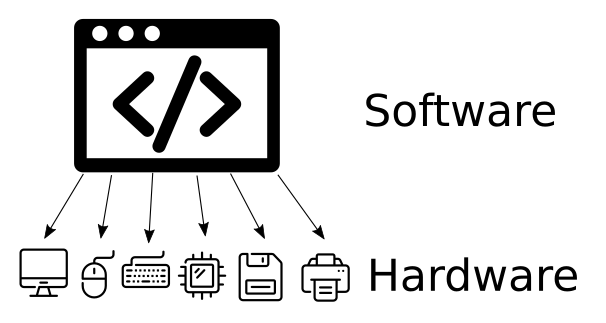

# Linux e você

## Resumo

### Objetivos
*Ao final desta sessão, você deverá ser capaz de:*
* Explique o que são os sistemas operacionais e o que é um kernel
* Explique o que é o kernel do Linux e quais são as distribuições do Linux

### Pontos chave
* Um sistema operacional é um pedaço de software que gerencia recursos de hardware e software e fornece serviços comuns para outro software executar
* Todos os sistemas operacionais incluem um kernel, que lida com as interações entre hardware e software
* Existem muitas distribuições de Linux, que são todos sistemas operacionais diferentes que usam o mesmo kernel Linux
* O Linux pode ser encontrado na maioria das casas, integrado em smartphones, dispositivos inteligentes, consoles de jogos e equipamentos de rede

:::info
Nesta sessão, usamos o conceito de _analogia_ bastante extensivamente. Uma analogia é uma comparação entre duas coisas que são semelhantes de alguma forma. Quando você faz uma analogia entre duas coisas diferentes, está comparando-as porque deseja tornar um conceito mais fácil de entender.
:::

## Discriminação

### O que é um sistema operacional?
Um sistema operacional é um software de sistema que gerencia o hardware do computador, recursos de software e fornece serviços comuns para programas de computador.

:::tip
Um sistema operacional é comumente abreviado como "OS" - pronunciado tanto "Oss" quanto "Oh-Es".
:::

:::info
Os primeiros sistemas operacionais eram pessoas! Os primeiros computadores eram muito caros para serem usados ​​por uma pessoa - em vez disso, os programadores abandonavam seus programas com os Operadores de Máquina (da mesma forma que você pode abandonar o correio). Essas pessoas agendavam e executavam os programas no computador, devolvendo os resultados (no papel) ao programador.
:::

### Exemplos de sistemas operacionais
* ** Windows ** - uma família de sistemas operacionais desenvolvidos pela Microsoft. Projetado principalmente para computadores desktop, laptop e servidor.
* ** Android ** - um sistema operacional * principalmente * desenvolvido pelo Google. Projetado principalmente para dispositivos touchscreen, como smartphones e tablets.
* ** macOS ** - um sistema operacional desenvolvido pela Apple. Projetado para desktops, laptops e servidores.
* ** iOS / ipadOS / tvOS / watchOS ** - uma família de sistemas operacionais baseados em macOS e desenvolvidos pela Apple para seus smartphones, tablets, televisores e smartwatches.

### Computadores sem sistemas operacionais

Os computadores podem funcionar sem um sistema operacional - os primeiros computadores costumavam funcionar, e os computadores muito leves ainda funcionam.

Os programadores podem interagir diretamente com o hardware - isso pode ser mais rápido e resultar em menos bugs. No entanto, o programador terá que escrever código para cada peça de hardware em que o programa possa ser executado!

O Nintendo Entertainment System (NES) é um exemplo de computador sem sistema operacional. Os desenvolvedores de jogos precisavam extrair todo o desempenho do console e, como todos os NES usavam o mesmo hardware, era mais fácil fazer isso.

### O que um sistema operacional faz?

:::note Analogia
Um sistema operacional é como uma equipe de espera em um restaurante; embora um cliente pudesse fazer seu pedido diretamente com o chef, e o chef simplesmente pudesse trazer a comida para a mesa, isso rapidamente se desfaz sob o estresse de mais de um ou dois clientes. A equipe em espera pode enfileirar pedidos, reservar mesas, limpar bagunça, fornecer menus e gerenciar restrições de recursos. A equipe de espera permite que vários chefs e vários clientes usem um restaurante com eficiência.
:::

#### Abstração de Hardware
Um sistema operacional pode * abstrair * o hardware do software. Isso significa que os programadores não precisam escrever seu software para trabalhar, por exemplo, cada marca e modelo de mouse. Em vez disso, os fabricantes de hardware apenas escrevem um driver para um sistema operacional, e o sistema operacional oferece um "mouse" genérico para o programador escrever seu software para uso.

Isso não só economiza tempo ao escrever software - também significa que, à medida que um novo hardware é lançado, o software antigo continuará trabalhando automaticamente com ele.

#### Serviços Comuns
Manter o tempo é surpreendentemente complexo - você precisa considerar tudo, desde fusos horários até segundos bissextos. Um sistema operacional pode fornecer isso como um serviço aos programadores, que podem simplesmente pedir "o tempo" e não se preocupar com mais nada.

Este é um exemplo de serviço que muitos programas precisam para operar, mas que é bastante complexo. Usuários e programadores preferem definir a hora apenas uma vez. Outros exemplos incluem filas de impressão e preferências de idioma.

#### Gerenciamento de software
Com o NES, mudar os programas era tão simples quanto conectar um novo cartucho. Os computadores modernos são mais complexos; os usuários esperam executar vários programas ao mesmo tempo, instalar programas diretamente no computador, atualizar programas e iniciá-los facilmente.

Os sistemas operacionais modernos fornecem interfaces para iniciar programas (por exemplo, o menu Iniciar), controlar os programas em execução (por exemplo, a barra de tarefas), instalar, atualizar e remover programas. Alguns sistemas operacionais até vêm com lojas de aplicativos para compra profissional